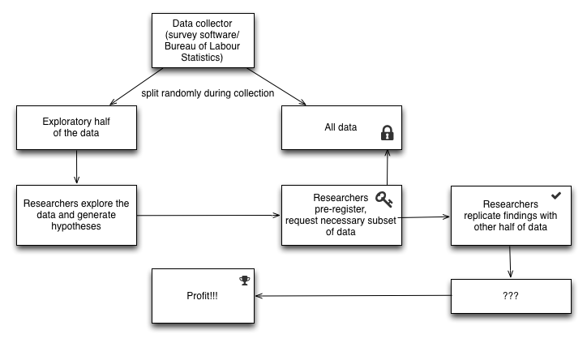

Title: Data trawling and bycatch – using it well
Author: Ruben Arslan
Date: 2014-02-27 12:00
Slug: data-trawling

<!-- PELICAN_BEGIN_SUMMARY -->
Pre-registration is starting to outgrow its old home, [clinical trials](http://neuroskeptic.blogspot.co.uk/2012/04/fixing-science-systems-and-politics.html). Because it is a good way to (a) show that your theory can make viable predictions and (b) that your empirical finding is not vulnerable to hypothesising after the results are known (HARKing) and some other questionable research practices, more and more scientists endorse and actually do pre-registration. [Many](http://funderstorms.wordpress.com/2014/02/25/nsf-gets-an-earful-about-replication/) remain wary though and [some](http://andrewgelman.com/2014/01/23/discussion-preregistration-research-studies/) simply think pre-registration cannot work for their kind of research. A recent amendment (October 2013) to the Declaration of Helsinki mandates public registration of all research on humans before recruiting the first subject and the publication of all results, positive, negative and inconclusive. 

For some of  science the widespread “fishing for significance” metaphor illustrates the problem well: Like an experimental scientist the fisherman casts out the rod many times, tinkering with a variety of baits and bobbers, one at a time, trying to make a good catch, but possibly developing a superstition about the best bobber. And, like an experimental scientist, if he returns the next day to the same spot, it would be easy to check whether the success of the bobber replicates. If he prefers to tell fishing lore and enshrine his bobber in a display at his home, other fishermen can evaluate his lore by doing as he did in his stories.

Some disciplines (epidemiology, economics, developmental and personality psychology come to mind) proceed, quite legitimately, more like fishing trawlers – that is to say data collection is a laborious, time-consuming, collaborative endeavour. Because these operations are so large and complex, some data bycatch will inevitably end up in the dragnet. 

<!-- PELICAN_END_SUMMARY -->
Consider a massive project like the National Longitudinal Survey of Youth. Of course the Bureau of Labour Statistics had some clear research questions (primarily related to the labour market) set out, when the project started. Still, the public, free NLSY data has since been used to answer many other questions that were almost certainly not originally envisioned. 

Unfortunately, research like this can engender superstitious beliefs as well and these are not so easily subjected to replication. It can happen because researchers explore the data, do not appropriately deal with multiple comparisons and then HARK, leading to exploratory research posing as confirmatory (ERPAC). But problems can also occur if  researchers analyse the data with an _a priori_ hypothesis and good intentions, mostly because publication bias is so prevalent: If only the few among many who happen to make the magic decisions (which can itself be [data-dependent](http://www.stat.columbia.edu/~gelman/research/unpublished/p_hacking.pdf)) leading to a significant result get to publish, all the other attempts are lost and the result looks less fickle than it really is.

So, if replication of such laborious efforts is hard or unlikely, we should look to other means to improve this kind of science. I think this situation can be remedied through pre-registration too. The NLSY already requires scientists to sign up for access and to choose the variables they need. Other data repositories even require researchers to formulate a research proposal before access is granted. The two could be combined, so that researchers state their hypothesis, how their analysis will look and which data they’ll need. Then, they’d only get the necessary data subset, preventing ERPAC and every attempted analysis would be on the record, mitigating publication bias.

However, this would prevent exploratory research and my impression is that this is the evil plan most frequently ascribed to pre-registration supporters. Again, I think this can be remedied within the framework of pre-registration to the benefit of confirmatory _and_ exploratory science: The NLSY contains information from more than 10 000 children, enough data to do research with only half of the data and still have more power than most other studies. So my suggestion to solve the problem is to __randomly choose half of the data and make it available for exploratory research__.

Every publication using such data would then be expected to replicate its central results in the other half. This way we would be assured that confirmatory research lived up to its name, but we would also improve exploratory research. After all, exploratory research can be more than tabulating hundreds of correlations and picking the ones with the most stars, a strategy that would hopefully die out if findings were to be replicated. Research that is based on a solid theory, so that predictions can be registered before looking at the data, would get a power boost because it could use the entire sample to test its predictions.

Now, consider a longitudinal study of high school exchange students – once a fledgling PhD has recruited two hundred and plans to track them for years to come, she won’t limit herself to asking them about homesickness, even if this is her primary research topic. At the same time the time constraints of a typical PhD may imply that not every possible research question and applicable theory is clear when data collection begins. Especially for novice researchers, the time it takes to run such a study may be sufficient for a complete methods overhaul. We should not want to force a newly-minted imputation specialist to use the pre-registered last-observation-carried-forward approach. In addition, it’s fairly common for other researchers to piggyback on such an effort, resulting in even more unintended combinations of variables and thus potentially answerable research questions. 

So, there will presumably be bycatch in this endeavour too and it’s important to use it efficiently. Imagine the data collection happens to include a survey before and after a deadly earthquake – this would make the data unique, impossible to replicate. Laborious studies need not be unique to make a replication unlikely, the cost of data collection does that job on its own.

And even for such designs pre-registration and the aforementioned split data procedure is possible: Data collection efforts in developmental and personality psychology could store data in a central repository (e.g. Dataverse) and give the researchers access to half of the data, until they pre-register. That way replication of the most complex and time-consuming studies would become a default rather than the rarest exception. In the meanwhile it is no technical problem to let survey software use all data and e.g. choose whom to remind to participate. I made such a survey software, formr.org,  which allows for separating the process of managing a longitudinal study (including reminders and personalised feedback) from having access to the data of interest, so I know this is technically possible. Admittedly, researchers may be too clingy parents to allow such a long separation from their data so early on.

Some advocates of open data might not like that the confirmatory half of the data would be gated, not publicly available. This concern may be alleviated by (a) not making it up to primary researchers to control access, but to a simple technical mechanism with public preservation of access requests (b) considering that longitudinal data can often be easily re-identified so that gated access is the only realistic option anyway and breaking up the data into subsets may in fact relax data protection constraints.

Another problem is that this method would double sample size requirements for exploratory studies. However, I’d hope researchers would see this as a tool to foster trust in their findings and willingly recruit more participants, which, as a fraction of the total time of preparing a complex longitudinal study, is a small part of the effort, especially if the management is automated. 

Unfortunately, splitting data into two halves and checking whether results replicate is not the most efficient cross-validation technique, just the only available one that can address the ERPAC problem. It also seems unlikely that splitting data on collection and separating it from the collectors would be possible for data that is not directly uploaded via a computer, e.g. videos, therapist diagnoses, neurological or genetic data, though such data could of course still be shared by primary investigators in the split repositories I described above. 

If this practice became adopted by some, we would foster a culture of properly annotated datasets (good metadata so you know which variables to pick in the pre-registration of your hypothesis), because even the primary researchers would have to use the same interface as secondary users. This seems like a hitherto unsolved problem in the advocacy of open data. 

The data would also be stored in central repositories, thus making it less likely that important data dies a lonesome death on someone’s USB stick. In addition, this method would enable exploratory researchers to benefit from initiatives such as [Registered Reports](http://cdn.elsevier.com/promis_misc/PROMIS%20pub_idt_CORTEX%20Guidelines_RR_29_04_2013.pdf), where papers are accepted on the basis of methods and proposed analysis, only in this case the methods would include the exploratory strategy (and possibly preliminary results) used to derive the predictions. 

Maybe this argument can soothe the [recently voiced fear](http://funderstorms.wordpress.com/2014/02/25/nsf-gets-an-earful-about-replication/) that pre-registration would increase the pressure to deliver the promised results and thus incentivise new questionable research practices. By design, pre-registration is meant to do the opposite. It need not mean pressure to deliver, endless forms or bureaucracy.  It can instead be an informal process where the forethought you put into your research anyway is written down and timestamped. 

