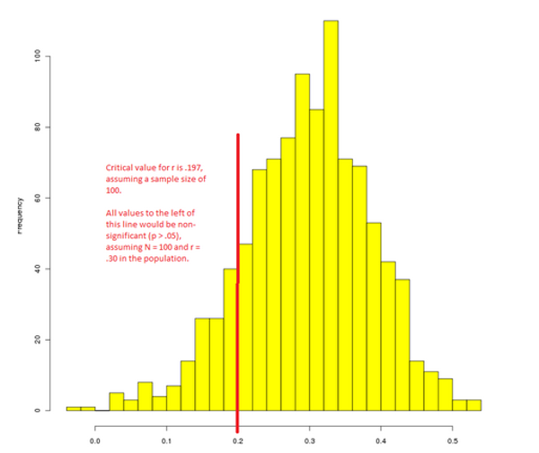
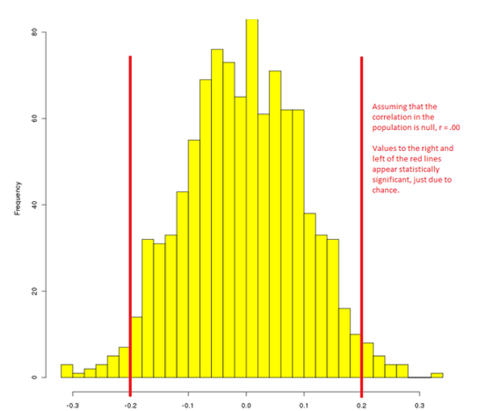

Title: Response to Jason Mitchell’s  “On the Emptiness of Failed Replications”
Author: Sean Mackinnon
Date: 2014-07-09 12:30
Slug: response-to-jason-mitchell

Jason Mitchell recently wrote an article entitled [“On the Emptiness of Failed Replications.”](http://wjh.harvard.edu/~jmitchel/writing/failed_science.htm). In this article, Dr. Mitchell takes an unconventional and extremely strong stance against replication, arguing that: “… studies that produce null results -- including preregistered studies -- should not be published.”  The crux of the argument seems to be that "scientists who get p > .05 are just incompetent." It completely ignores the possibility that a positive result could also (maybe even equally) be due to experimenter error. Dr. Mitchell also appears to ignore the possibility of simply getting a false positive (which is expected to happen under the null in 5% of cases).  

More importantly, it ignores issues of effect size and treats the outcome of research as a dichotomous "success or fail.” The advantages of examining effect sizes over simple directional hypotheses using null hypothesis significance testing are beyond the scope of this short post, but you might check out [Sullivan and Feinn (2012)](http://www.ncbi.nlm.nih.gov/pmc/articles/PMC3444174/) as an open-access starting point. Generally speaking, the problem is that sampling variation means that some experiments will find null results even when the experimenter does everything right. As an illustration, below is 1000 simulated correlations, assuming that r = .30 in the population, and a sample size of 100 (I used a [monte carlo method](http://www.quantpsy.org/rci/rci.htm)).

 

In this picture, the units of analysis are individual correlations obtained in 1 of 1000 hypothetical research studies. The x-axis is the value of the correlation coefficient found, and the y-axis is the number of studies reporting that value. The red line is the critical value for significant results at p < .05 assuming a sample size of 100. As you can see from this picture, the majority of studies are supportive of an effect that is greater than zero. However (simply due to chance) all the studies to the left of the red line turned out non-significant. If we suppressed all the null results (i.e., all those unlucky scientists to the left of the red line) as Dr. Mitchell suggests, then our estimate of the effect size in the population would be inaccurate; specifically, it would appear to be larger than it really is, because certain aspects of random variation (i.e., null results) are being selectively suppressed. Without the minority of null findings (in addition to the majority of positive findings) the overall estimate of the effect cannot be correctly estimated. 

The situation is even more grim if there really is no effect in the population. 

 

In this case, a small proportion of studies will produce false positives, with a roughly equal chance of an effect in either direction. If we fail to report null results, false positives may be reified as substantive effects. The reversal of signs across repeated studies might be a warning sign that the effect doesn’t really exist, but without replication, a single false positive could define a field if it happens (by chance) to be in line with prior theory.

With this in mind, I also disagree that replications are “publicly impugning the scientific integrity of their colleagues.” Some people feel threatened or attacked by replication. The ideas we produce as scientists are close to our hearts, and we tend to get defensive when they’re challenged. If we focus on effect sizes, rather than the “success or fail” logic of null hypothesis significance testing, then I don’t believe that “failed” replications damage the integrity of the original author, but rather simply suggests that we should modulate the estimate of the effect size downwards. In this framework, replication is less about “proving someone wrong” and more about centering on the magnitude of an effect size. 

Something that is often missed in discussion of replication is that the very nature of randomness inherent in the statistical procedures scientists use means that any individual study (even if perfectly conducted) will probably generate an effect size that is a bit larger or smaller than it is in the population. It is only through repeated experiments that we are able to center on an accurate estimate of the effect size.  This issue is independent of researcher competence, and means that even the most competent researchers will come to the wrong conclusions occasionally because of the statistical procedures and cutoffs we’ve chosen to rely on. With this in mind, people should be aware that a failed replication does not necessarily mean that one of the two researchers is incorrect or incompetent – instead, it is assumed (until further evidence is collected) that the best estimate is a weighted average of the effect size from each research study.

For some more commentary from other bloggers, you might check out the following links:

["Are replication efforts pointless?"](http://tomsett.me.uk/are-replication-efforts-pointless/) by [Richard Tomsett](http://tomsett.me.uk/about/)
 
["Being as wrong as can be on the so-called replication crisis of science"](http://scientopia.org/blogs/drugmonkey/2014/07/07/being-as-wrong-as-can-be-on-the-so-called-replication-crisis-of-science/) by drugmonkey at [Scientopia](http://scientopia.org/blogs/)
 
["Are replication efforts useless?"](http://janneinosaka.blogspot.jp/2014/07/are-replication-efforts-useless.html) by [Jan Moren](http://janneinosaka.blogspot.jp/)
 
["Jason Mitchell’s essay"](http://filedrawer.wordpress.com/2014/07/07/jason-mitchells-essay/) by [Chris Said](http://filedrawer.wordpress.com/)
 
["#MethodsWeDontReport – brief thought on Jason Mitchell versus the replicators"](http://neuroconscience.com/2014/07/08/methodswedontreport-brief-thought-on-jason-mitchell-versus-the-replicators/) by [Micah Allen](http://neuroconscience.com/micah-allen/)

["On 'On the emptiness of failed replications'"](http://blogs.discovermagazine.com/neuroskeptic/2014/07/07/emptiness-failed-replications/#.U7wKgBYyxgp) by [Neuroskeptic](http://discovermagazine.com/authors?name=Neuroskeptic)
